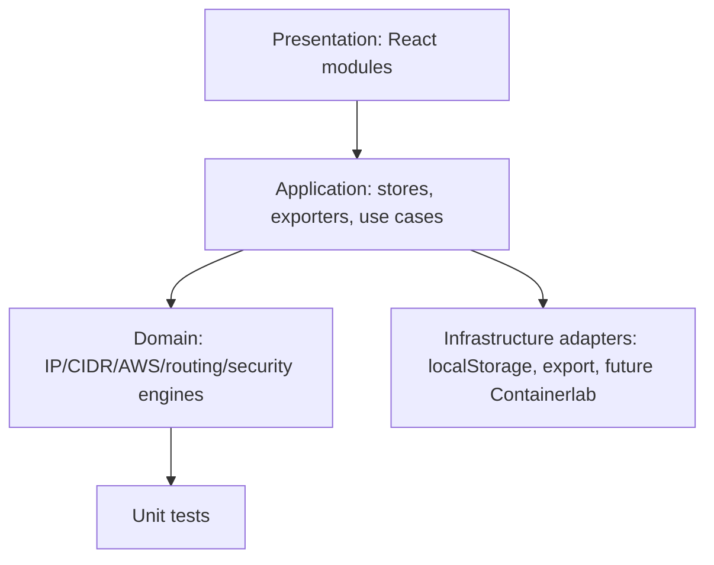

# IP Intelligence Platform

A local-first, no-backend educational networking platform built with Vite, React, TypeScript, TailwindCSS, Zustand and React Flow.

## Modules

- IP address calculator for IPv4/IPv6 classification, decimal/binary/hex/octal/RFC metadata
- CIDR, subnet, VLSM, supernet and binary calculators
- AWS VPC CIDR designer with overlap and capacity validation
- Browser-persisted IPAM for projects, VPCs, subnets and host inventory
- Network topology and packet-flow visualization
- Route-table longest-prefix-match simulator
- Security Group and NACL simulator
- Offline AI assistant scaffold and education mode
- Export adapters for JSON, YAML, Terraform and Containerlab

## Quick start

```bash
npm install
npm run dev
npm test
npm run build
```

## Architecture



## No backend strategy

The app is local-first. Domain services are pure TypeScript. IPAM state is persisted in browser storage. REST, GraphQL and OpenAPI designs are documented under `docs/` as future optional adapters or mock contracts.
