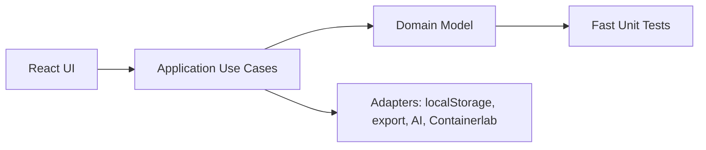
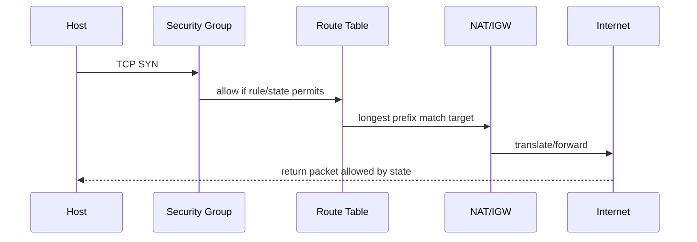
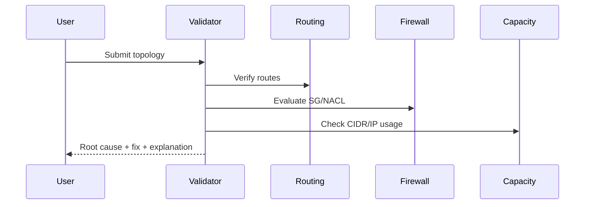

# Architecture Diagrams

## Clean Architecture

```mermaid
flowchart LR
  React[React UI] --> UseCases[Application Use Cases]
  UseCases --> Domain[Domain Model]
  UseCases --> Adapters[Adapters: localStorage, export, AI, Containerlab]
  Domain --> Tests[Fast Unit Tests]
```

## Network Flow Diagram

```mermaid
sequenceDiagram
  participant Host
  participant SG as Security Group
  participant RT as Route Table
  participant NAT as NAT/IGW
  participant Internet
  Host->>SG: TCP SYN
  SG->>RT: allow if rule/state permits
  RT->>NAT: longest prefix match target
  NAT->>Internet: translate/forward
  Internet-->>Host: return packet allowed by state
```

## Troubleshooting Sequence

```mermaid
sequenceDiagram
  User->>Validator: Submit topology
  Validator->>Routing: Verify routes
  Validator->>Firewall: Evaluate SG/NACL
  Validator->>Capacity: Check CIDR/IP usage
  Validator-->>User: Root cause + fix + explanation
```
