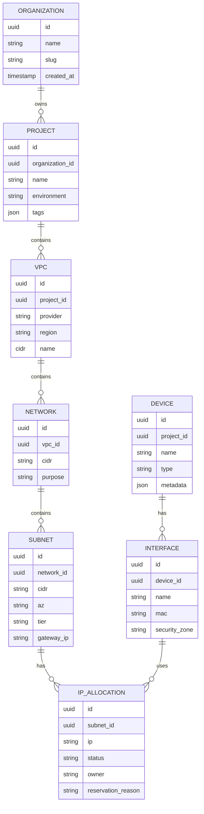

# Database Schema

The MVP is no-backend and uses browser persistence. This schema is the canonical model for IndexedDB/PostgreSQL if a backend is later added.

Statuses: `allocated`, `released`, `reserved`, `locked`.
